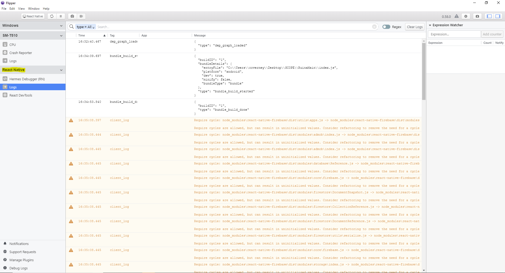

# Flipper Debugger Setup Guide
## Setup Guide for Android
Reference [this](https://fbflipper.com/docs/getting-started/react-native-android) page if you need to setup Flipper for a React Native Android app from scratch. **The RuinaMain repo should already include the code necessary on the Android side to get Flipper working.** All you need to do is to download the desktop app from [here](https://fbflipper.com/docs/getting-started/index).

To use Flipper with Android, please follow these steps:
1. Open up the Flipper desktop app (for Windows this involves opening the Flipper.exe file that you downloaded)
2. Make sure your Android project is up to date and built successfully
3. Make sure your tablet is plugged and connected to Android Studio (or you could use an emulator, just make sure it is running)
4. Open up a terminal window, cd into the RuinaMain main directory, and then run `react-native run-android`
5. Check to make sure there is a "React Native" section in your Flipper desktop app. The logs should be printed in real time in the logs feature (reference image below)

### Troubleshooting
If Flipper isn't working then you can try to following
- Close the app (and terminal window!!) and restart the app
- Update React Native by typing `npx react-native upgrade` in a terminal within the RuinaMain folder  

## Setup Guide for iOS
To be completed
