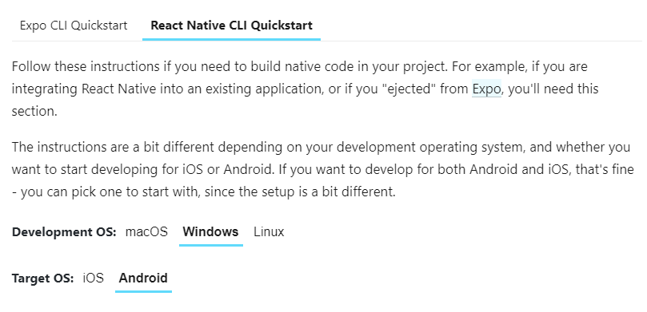
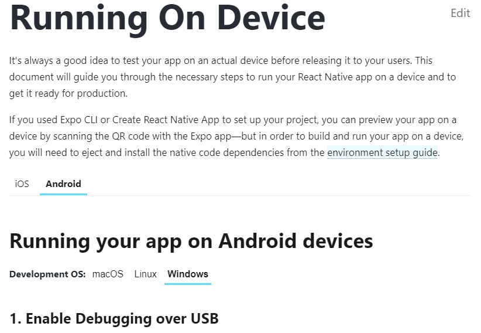
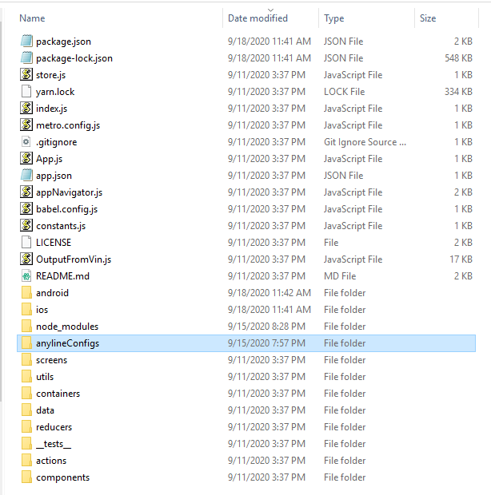

# Windows Installation Guide
Follow the instructions described below if you want to setup `RuinaMain` using Windows and Android Studio.

## Using a tablet
1. Follow [this](https://reactnative.dev/docs/environment-setup) react native tutorial (select React Native CLI Quickstart, Windows, and Android)
  * Make sure to select Android 9 (Pie) and Android SDK Platform 28 instead of the new versions. This can be done by following the green highlight portion in [this](https://docs.google.com/document/d/1Jq3eBB1jNj5tPj4pSyWM1NAS5JwnqvRIsML5aK6KDPE/edit?usp=sharing) google document

  
2. Follow section 1 of [this](https://reactnative.dev/docs/running-on-device) tutorial to connect a tablet with Android (select Android and Windows)

  
3. Clone the `RuinaMain` [repo](https://github.com/santosfamilyfoundation/RuinaMain)
  * In a terminal, `cd` into the main directory of the repo
  * `rmdir /s node_modules`
  * `npm install`
  * `react-native run-android` (make sure your tablet is plugged in and registered as a device when you type `adb devices` into a terminal) Alas, due to the nature of software development, this command will probably not work right off the bat, so complete steps 4 to 8
4. In order to get the app running, you need to add the required Anyline config files   
  * To add them, create a new folder called `anylineConfigs` in your `RuinaMain` directory
  * Download all the files from [here](https://drive.google.com/drive/folders/1R-s-ASSDIUl32IrHriw40iRoKcLCaVOv), and put them in the `anylineConfigs` folder  

  
5. If the `react-native` command is not recognized in the command prompt, then run `npm install -g react-native-cli` to install react-native-cli globally
6. Rebuild the Android folder with the following commands
    * `cd android`
    * `gradlew clean`
    * `cd ..`
    * `react-native run-android`
7. If you have a gradle problem, you probably need to install it (newest version is fine). Just follow [this](https://gradle.org/install/) tutorial
8. You might have to install an older version of node. I installed [this](https://nodejs.org/dist/v8.17.0/) one
9. Once you make a change, you can keep running `react-native run-android` to see whether the app correctly builds and opens  

## Using an Emulator
**Note:** using an emulator requires the same steps as the above section but instead of doing step 2, you have to set up the emulator. You can do this by following the "Using a virtual device" section in the react native setup [tutorial](https://reactnative.dev/docs/environment-setup) (select React Native CLI Quickstart, Windows, and Android). Don't forget to launch your Android Virtual Device before running `react-native run-android`!
